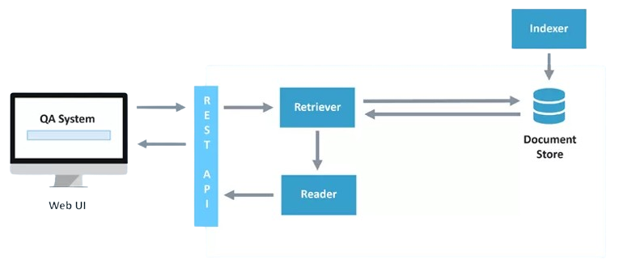

# e-elections


## Description


## Installation

```bash
# Create virtual envirenment
$ python3 -m venv dcas
# Activate virtual envirenment
$ source dcas/bin/activate
# Install dependencies
$ pip install -r requirements.txt
```